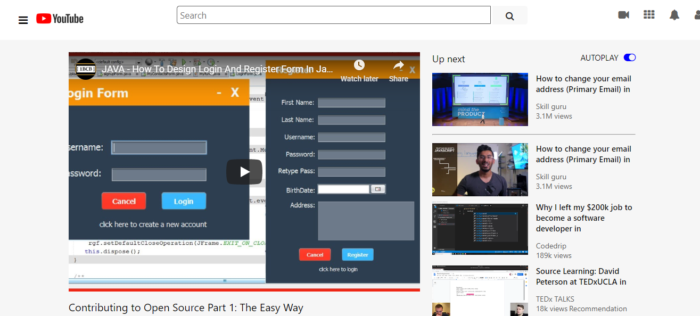

# youtube-clone

> Embedding images and videos.

This is a youtube clone of embedding images and videos .

## Built With

- html, css, javascript
- vscode

## Live Demo

[Live Demo Link]()

## Getting Started

To get a local copy up and running follow these simple example steps.

### Prerequisites
- web browser
- Code editor
- Git and Github

### Setup

### Install

### Usage

### Run tests

### Deployment

## Authors

- Okiror Frank
- Okikiola Apelehin

👤 **Author1**

- Github: [@githubhandle](https://github.com/frankopkusianwar)
- Twitter: [@twitterhandle](https://twitter.com/franko0781)
- Linkedin: [linkedin](https://linkedin.com/)

👤 **Author2**

- Github: [@githubhandle](https://github.com/okikiola11)
- Twitter: [@twitterhandle](https://twitter.com/Kikiolla3)
- Linkedin: [linkedin](https://linkedin.com/)

## 🤝 Contributing

Contributions, issues and feature requests are welcome!

Feel free to check the [issues page](issues/).

## Show your support

Give a ⭐️ if you like this project!

## Acknowledgments

- Google

## 📝 License

This project is [MIT](lic.url) licensed.
